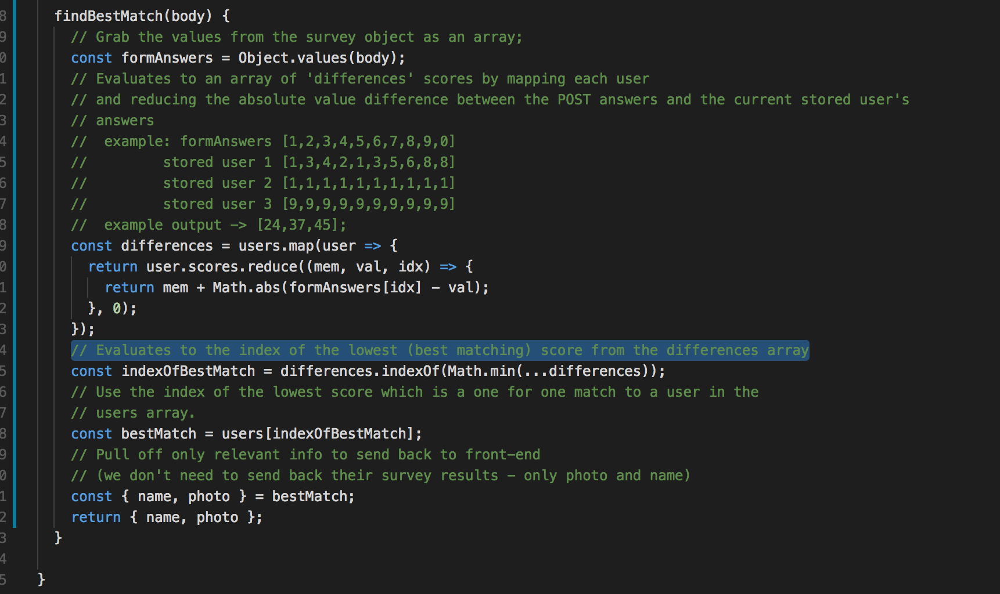

# Adult Friend Finder
See the project hosted on [Heroku](https://floating-escarpment-14236.herokuapp.com/) 

### About
This app will find compatible users based on survey results.

## How to run local copy
```
git clone https://github.com/Unobtainiumrock/friend-finder.git

cd friend-finder

npm install

npm start

```
After running those commands, nagivate to http://localhost:3000/ in your browser.

**Important:** Make sure you run the `npm start` script. This will run a build process I fiddled around with.

## The Compatibility Algorithm

**1. First we need to see what data is being iterated**
```javascript
const users = [
  {
    name: 'Unobtainiumrock',
    photo: 'https://media.giphy.com/media/pqwPJPgR6qCB2/giphy.gif',
    scores: [1,3,4,2,1,3,5,5,5,5]
  },
  {
    name: 'Jerry',
    photo: 'https://media3.giphy.com/media/S1phUc5mmaZqM/giphy.gif',
    scores: [1,1,1,1,1,1,1,1,1,1]
  },
  {
    name: 'Bacon',
    photo: 'https://media.giphy.com/media/9OUckbQ3EreNy/giphy.gif',
    scores: [5,5,5,5,5,5,5,5,5,5]
  }
];
```
**2. Cross reference with my annotated algorithm**



#### Algorithm comments
  I really wanted to do this in a way that didn't involve nested loops. I don't think this was possible because we need to get the specific relationship between each survey question and each existing user's survey question. If it was just a matter of taking the absolute value of the difference between two survey sums, it would be fairly straightforward since we can sum the the survey results as they are submitted to the back-end.

**In other words, this is nicer**
```javascript 
// Survey answers
[1,2,3] //total of 6 
// Comparison from existing
[2,1,4] //total of 7

//Absolute value of the difference is 1
```
**than this (what was ask for)**
```javascript
//Survey Answers
[1,2,3] 
// Comparison from existing
[2,1,4] 

Math.abs(1 - 2) + Math.abs(2 - 1) + Math.abs(3 - 4)
```

**A note about mixing of import and require**
 
 I was able to sucessfully run a build process with babel (for fun), but I didn't have time to implement webpack for ESM syntax on non-npm modules. Its a simple fix, but time constraints got in the way.

#### Sources on build processes, plus ESM vs CJS
https://www.jaygould.co.uk/devops/2017/11/14/cloud-deployment-heroku-node-babel.html

https://medium.com/@kimtnguyen/how-to-deploy-es6-node-js-express-back-end-to-heroku-7e6743e8d2ff

https://medium.com/webpack/the-state-of-javascript-modules-4636d1774358

https://blogs.windows.com/msedgedev/2017/08/10/es-modules-node-today/

